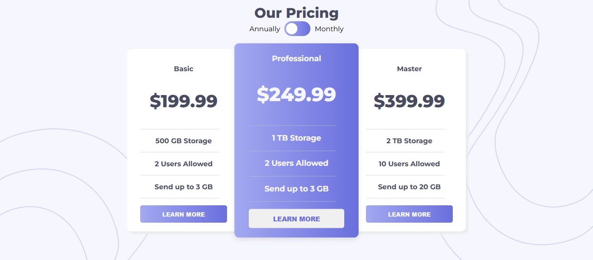

# Frontend Mentor - Pricing component with toggle solution

This is a solution to the [Pricing component with toggle challenge on Frontend Mentor](https://www.frontendmentor.io/challenges/pricing-component-with-toggle-8vPwRMIC). Frontend Mentor challenges help you improve your coding skills by building realistic projects. 

## Overview

### The challenge

Users should be able to:

- View the optimal layout for the component depending on their device's screen size
- Control the toggle with both their mouse/trackpad and their keyboard
- **Bonus**: Complete the challenge with just HTML and CSS

### Screenshot




### Links

- Solution URL: [Solution](https://github.com/FarisahHannes2210/expenses-chart-component-frontend-mentor)
- Live Site URL: [live site](https://FarisahHannes2210.github.io/expenses-chart-component-frontend-mentor)

## My process


### What I learned

- Designing an Aesthetic Toggle Switch with CSS 
- Toggling Pricing Display Using `display: block` and `display: none`
- Enhancing Background Styling with CSS Techniques


```css

/* toggle switch */
#toggle_switch {
  position: relative;
  margin: auto;
  display: flex;
  align-items: center;
  justify-content: center;
  gap: 10px;
}

.switch {
  position: relative;
  display: inline-block;
  width: 60px;
  height: 34px;
  
}

.switch input {
  opacity: 0;
  width: 0;
  height: 0;
}

.slider {
  position: absolute;
  cursor: pointer;
  top: 0;
  left: 0;
  right: 0;
  bottom: 0;
  background-color: hsl(236, 72%, 79%);
  background-image: var(--LinearGradient);
  -webkit-transition: 0.4s;
  transition: 0.4s;
}

.slider:hover {
  opacity: 50%;
}

.slider:before {
  position: absolute;
  content: "";
  height: 26px;
  width: 26px;
  left: 4px;
  bottom: 4px;
  background-color: white;
  -webkit-transition: 0.4s;
  transition: 0.4s;
}

input:checked + .slider {
  background-color: hsl(236, 72%, 79%);
  background-image: var(--LinearGradient);
   
}

input:focus + .slider {
  background-color: hsl(236, 72%, 79%);
  background-image: var(--LinearGradient);
}

input:checked + .slider:before {
  -webkit-transform: translateX(26px);
  -ms-transform: translateX(26px);
  transform: translateX(26px);
}

input:checked + .slider:before~ #container .card .monthly-price {
  display: block;
}

input:checked + .slider:before ~ #container .card .annual-price {
  display: none;
}

/* Rounded sliders */
.slider.round {
  border-radius: 34px;
}

.slider.round:before {
  border-radius: 50%;
}

  /* style background image */
body {
  justify-content: center;
  align-self: center;
  text-align: center;
  margin: 10px;
  display: block;
  background-color: var(--VeryLightGrayishBlue);
  background-image: url(./images/bg-top.svg), url(./images/bg-bottom.svg);
  background-repeat: no-repeat;
  background-position: top right, bottom left ;
  background-attachment:
}

```

```js
    //toggle here
    if(toggle.checked == true){ //check toggle = monthly
       
        basic_monthly.style.display = "block";
        basic_anually.style.display = "none";

        pro_monthly.style.display = "block";
        pro_anually.style.display = "none";

        master_monthly.style.display = "block";
        master_anually.style.display = "none";

    }
    else if(toggle.checked == false){ // uncheck toggle = anually

        basic_monthly.style.display = "none";
        basic_anually.style.display = "block";

        pro_monthly.style.display = "none";
        pro_anually.style.display = "block";

        master_monthly.style.display = "none";
        master_anually.style.display = "block";
     
    }
```

## Author

- Website - [Farisah Hannes](https://sites.google.com/view/farisahhannes/)
- Frontend Mentor - [@FarisahHannes2210](https://www.frontendmentor.io/profile/FarisahHannes2210)
